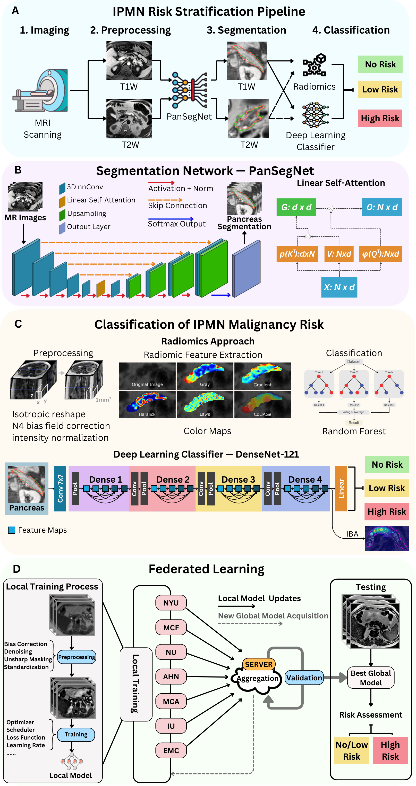

# Cyst-X: A Multi-Center MRI Benchmark and Federated Learning Framework for Malignancy-Risk Stratification of Pancreatic Cystic Neoplasm


[](https://osf.io/74vfs/) 
Dataset: https://osf.io/74vfs/

Official implementation of **Cyst-X**, an end-to-end multi-center pipeline integrating state-of-the-art pancreas segmentation, federated optimization, and classical radiomics pipelines for automated malignancy risk stratification of intraductal papillary mucinous neoplasms (IPMNs).

---

<p align="center">
  
</p>


## 📌 Overview

Pancreatic cancer is projected to be the second-deadliest cancer by 2030, making early detection critical. IPMNs are key cancer precursors, but current consensus guidelines struggle to stratify malignancy risk accurately. 

**Cyst-X** addresses this structural bottleneck by providing:
1. **The Largest Multi-Center Pancreas MRI Resource:** 1,461 abdominal MRI scans from 764 patients across seven international medical centers with expert annotations and pathology-anchored ground truth.
2. **Advanced Pancreas Segmentation:** Integrating `PanSegNet` (a linear self-attention transformer-based backbone) for high-fidelity region of interest (ROI) extraction.
3. **Privacy-Preserving Federated Learning:** Distributed risk classification training utilizing `FedAvg` and `FedProx` without exchanging raw clinical images.


## 📂 Repository Structure
```filesystem
Cyst-X/
├── Classification/          # Pipelines and frameworks for deep risk modeling
├── Segmentation/            # Pipeline and engines for pancreas ROI localization
└── README.md                # Main repository documentation hub
```
